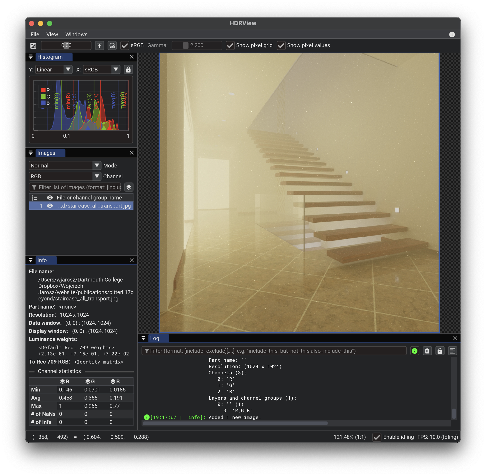
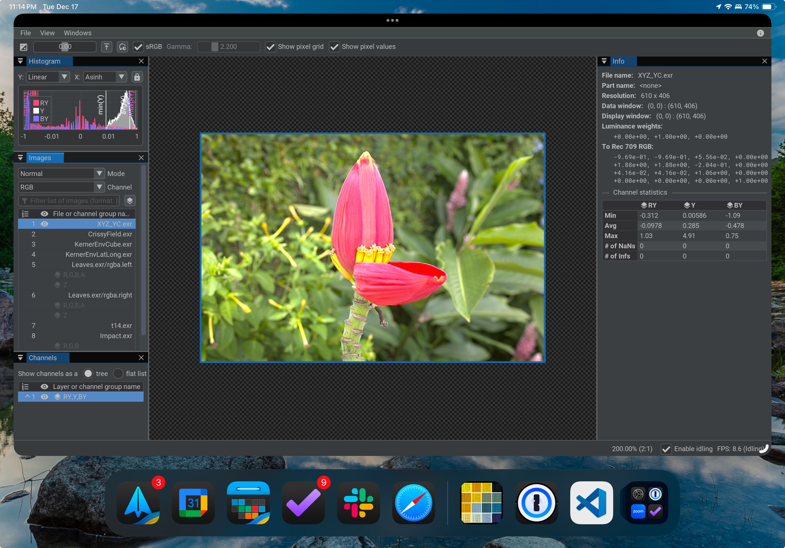
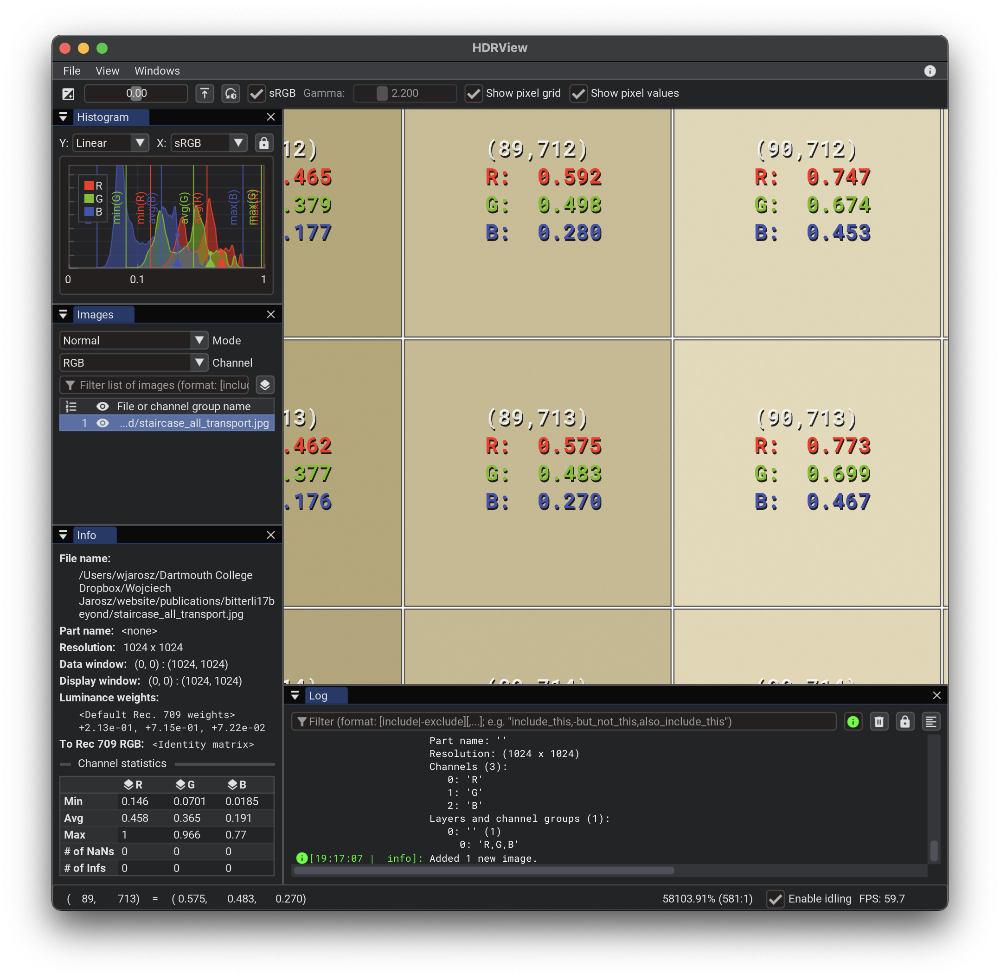
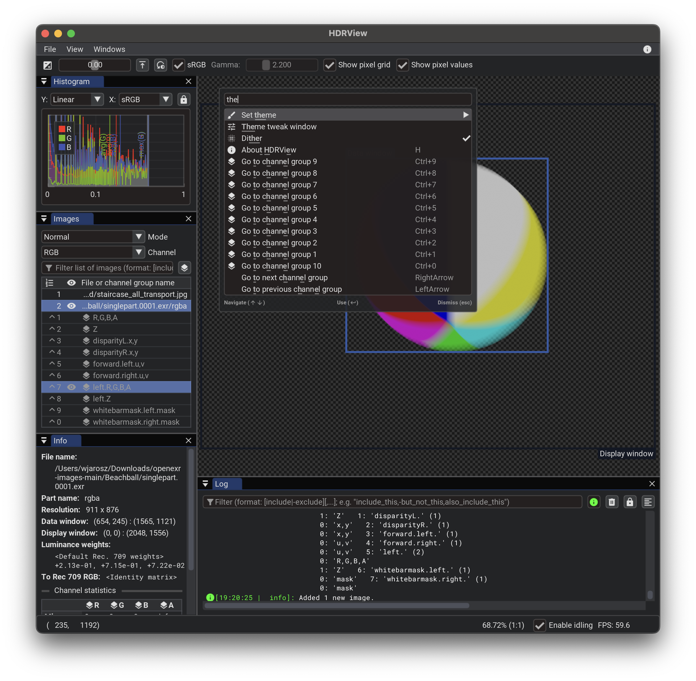

# HDRView

Master branch:
[](https://github.com/wkjarosz/hdrview/actions/workflows/ci-mac.yml)
[](https://github.com/wkjarosz/hdrview/actions/workflows/ci-linux.yml)
[](https://github.com/wkjarosz/hdrview/actions/workflows/ci-windows.yml)

HDRView is a simple research-oriented high-dynamic range image viewer with an emphasis on examining and comparing images. HDRView currently supports reading (EXR, HDR, PFM, and Ultra HDR JPEG) and writing (EXR, HDR, PFM) several HDR image formats, as well as reading (PNG, TGA, BMP, JPG, GIF, PNM, and PSD) and writing (PNG, TGA, PPM, PFM, and BMP) standard LDR images.

HDRView can display images in true HDR on Apple extended dynamic range (EDR) and 10-bit displays.

HDRView runs on macOS, Linux, Windows, and directly in your browser -- just go to [wkjarosz.github.io/hdrview/](https://wkjarosz.github.io/hdrview/) for the latest release version and [wkjarosz.github.io/hdrview/dev](https://wkjarosz.github.io/hdrview/dev) for the development version. This even works on an iPhone or iPad! Try it out.

## Example screenshots
Here's a screenshot of HDRView viewing a JPEG on macOS:


Or, running on an iPad as a webapp, viewing a luminance-chroma EXR image stored using XYZ primaries with chroma subsampling:


When sufficiently zoomed in, HDRView can overlay the pixel grid and numeric color values on each pixel to facilitate inspection:


HDRView features extensive keyboard shortcuts, and pressing `Cmd+Shift+P` brings up a VS Code/Atom/Sublime Text-style command palette allowing you to find any command with keyboard-based fuzzy searching:


HDRView supports the extended dynamic range (XDR, 30 bit) capabilities of recent Macs, allowing it to use finer precision (reducing banding) and brighter whites (reducing clipping) when displaying HDR images.

When displaying images on a standard dynamic range (SDR, 24 bit) display (or saving to an LDR file format), HDRView uses blue-noise dithering:


This reduces apparent banding artifacts in smooth gradients compared to naively displaying HDR images on such displays:


## Obtaining/running HDRView

If you are running a recent version of macOS or Windows, you can download the pre-built binary installer DMG or zip file from the [releases page](https://github.com/wkjarosz/hdrview/releases). For Linux, you will need to build HDRView from source for now. Or, just run the [web app version](https://wkjarosz.github.io/hdrview/) directly in your browser.

## Compiling

Compiling from scratch requires CMake and a recent version of the XCode build tools on macOS, Visual Studio on Windows, and GCC on Linux.

Compiling should be as simple as:
```bash
1 ~ % git clone https://github.com/wkjarosz/hdrview.git
2 ~ % cd hdrview
3 ~ % mkdir build
4 ~ % cmake -B build
5 ~ % cmake --build build/ --parallel 4
```

On macOS and Linux you can add `-G Ninja` to line 4 (on Windows Ninja fails to build the OpenEXR dependency).

To support UltraHDR JPEG images, you will either need to have `libultrahdr` installed, or pass the option `-DHDRVIEW_BUILD_UHDR_DEPS=ON` in line 4.

Alternatively, you should be able to do all this via VS Code if you have the CMake extension set up properly.

Or, you can start via ``cmake-gui`` if you prefer. Run ``Configure`` and select your desired build system. Then click ``Generate``. Then open the solution/project/makefile in your IDE of choice.

## Installation
On macOS you can just copy the `HDRView.app` bundle to your `/Applications` folder. 

On Windows you'll need to copy `HDRView.exe` together with the accompanying `assets` folder to your desired installation location.

Recent version of macOS will complain that the app is unsigned and from an unknown developer. You will need to go to the Security and Privacy part of system Settings to allow the app to run.

## Running from the terminal

You can also run HDRView from the terminal. Run ``HDRView --help`` to see the command-line options. On macOS the executable is stored within the app bundle in `HDRView.app/Contents/MacOS/HDRView`. You might want to add it, or a symlink, to your path.

## License

Copyright (c) Wojciech Jarosz

3-clause BSD. For details, see the ``LICENSE.txt`` file.

HDRView builds on a number libraries. See the details in the Credits tab of the About dialog.
