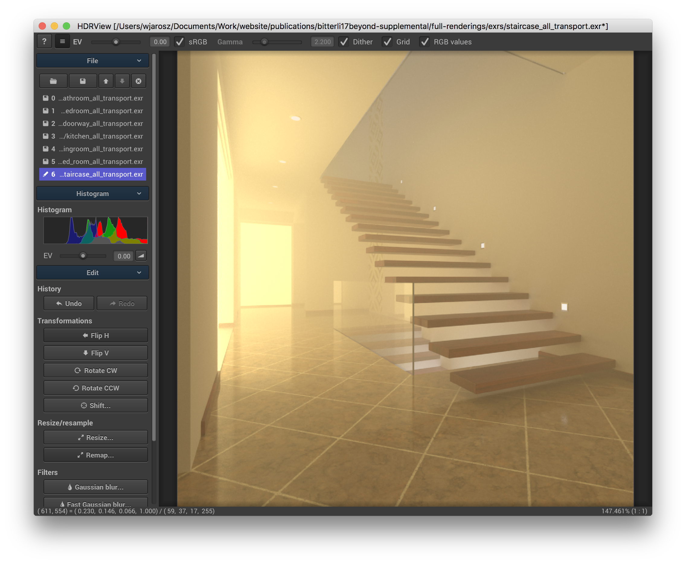
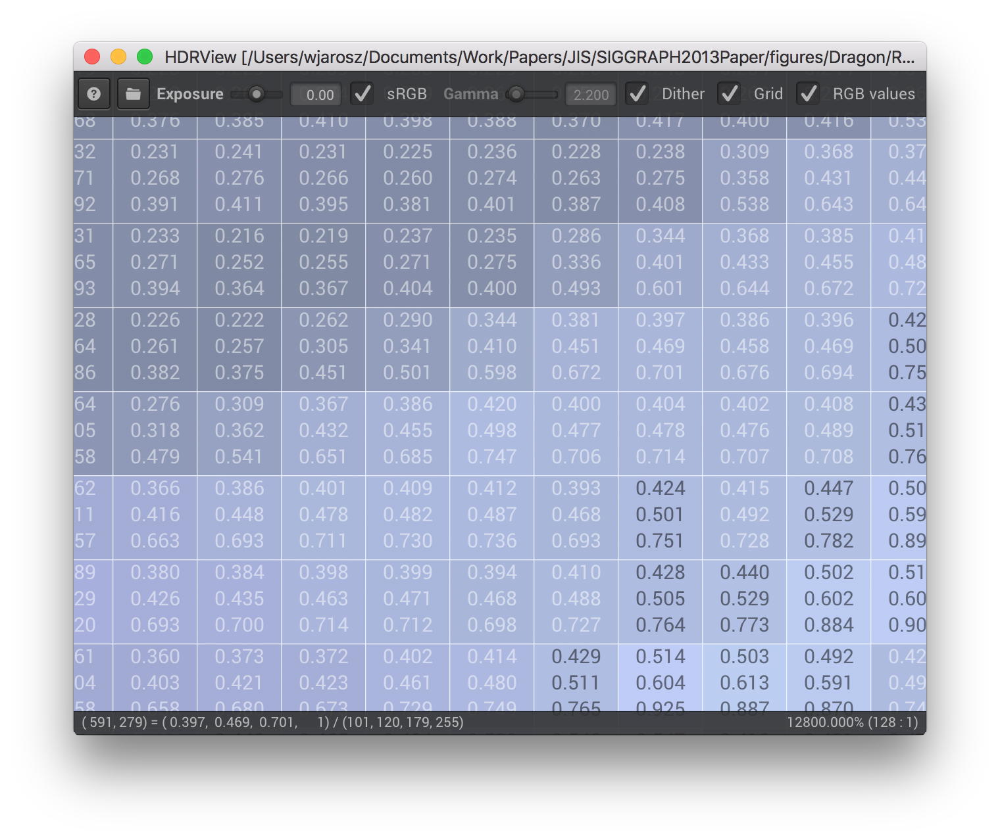
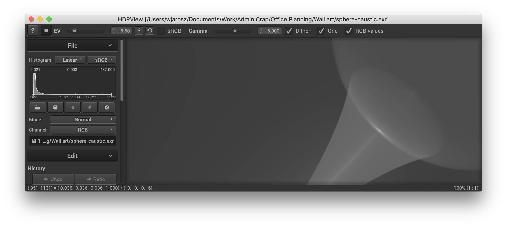
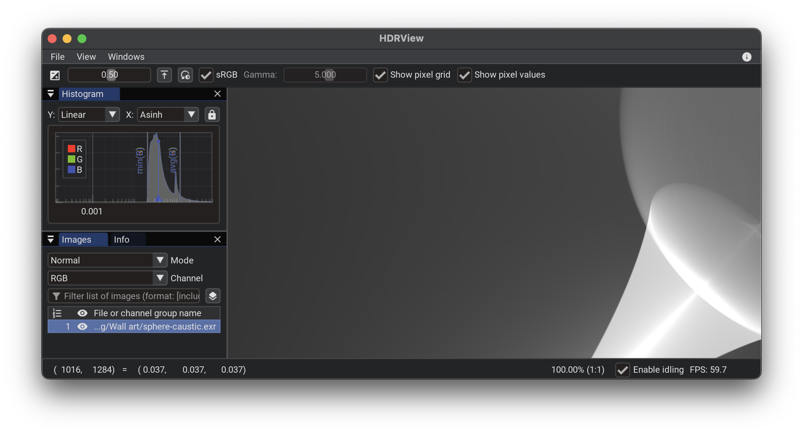

# HDRView

Master branch:

HDRView is a simple research-oriented high-dynamic range image viewer with an emphasis on examining and comparing images. HDRView currently supports reading EXR, PNG, TGA, BMP, HDR, JPG, GIF, PNM, PFM, and PSD images and writing EXR, HDR, PNG, TGA, PPM, PFM, and BMP images.

HDRView can display true HDR on Apple extended dynamic range (EDR) and 10-bit displays.

## Example screenshots
HDRView supports loading several images and provides exposure and gamma/sRGB tone mapping control with high-quality dithering of HDR images.

When sufficiently zoomed in, HDRView can overlay the pixel grid and numeric color values on each pixel to facilitate inspection:

In addition to the menubar, HDRView features extensive keyboard shortcuts, and pressing `Cmd+Shift+P` brings up a VS Code/Atom/Sublime Text-style command palette allowing you to find any command with keyboard-based fuzzy searching:

HDRView supports the extended dynamic range (XDR, 30 bit) capabilities of recent Macs, allowing it to use finer precision (reducing banding) and brighter whites (reducing clipping) when displaying HDR images.

When displaying images on a standard dynamic range (SDR, 24 bit) display (or saving to an LDR file format), HDRView uses high-quality dithering:

This reduces apparent banding artifacts in smooth gradients compared to naively displaying HDR images such displays:

## Obtaining HDRView

If you are running a recent version of macOS or Windows, you can download the pre-built binary installer DMG or zip file from the [releases page](https://github.com/wkjarosz/hdrview/releases). For Linux, you will need to build HDRView from source for now.

## Compiling

Compiling from scratch requires CMake and a recent version of the XCode build tools on macOS, Visual Studio on Windows, and GCC on Linux.

### Linux and macOS

On Linux and macOS, compiling should be as simple as

    git clone https://github.com/wkjarosz/hdrview.git
    cd hdrview
    mkdir build
    cmake -B build -G Ninja 
    cmake --build build/ --parallel 4

### Windows

On Windows, you can run:

    git clone https://github.com/wkjarosz/hdrview.git
    cd hdrview
    mkdir build
    cmake -B build
    cmake --build build/ --parallel 4

You can also do this through ``cmake-gui`` if you prefer. Run ``Configure`` and select your version of Visual C++ and 64bit. Then click ``Generate``.

Open the generated file ``HDRView.sln`` and proceed building as usual from within Visual Studio.

## Usage

Run ``./hdrview --help`` to see the command-line options, or run ``./hdrview `` and hit the ``h`` button to see a list of keyboard shortcuts in the application.

## License

Copyright (c) Wojciech Jarosz

3-clause BSD. For details, see the ``LICENSE.txt`` file.

HDRView builds on a number libraries. See the details in the Credits tab of the About dialog.
