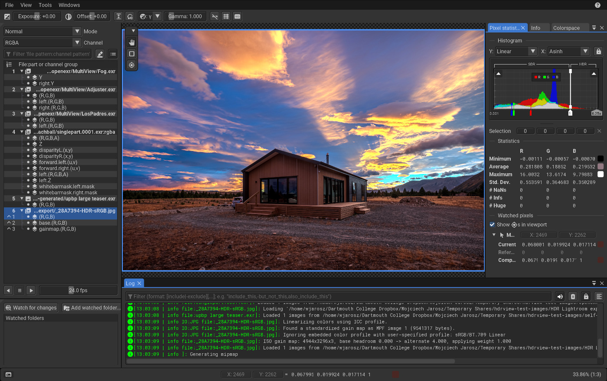
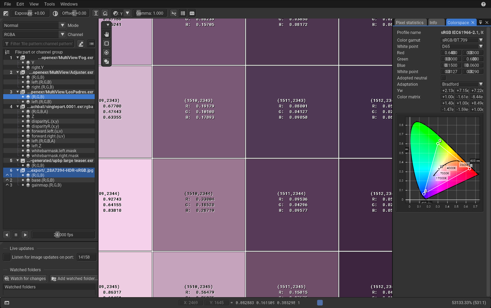
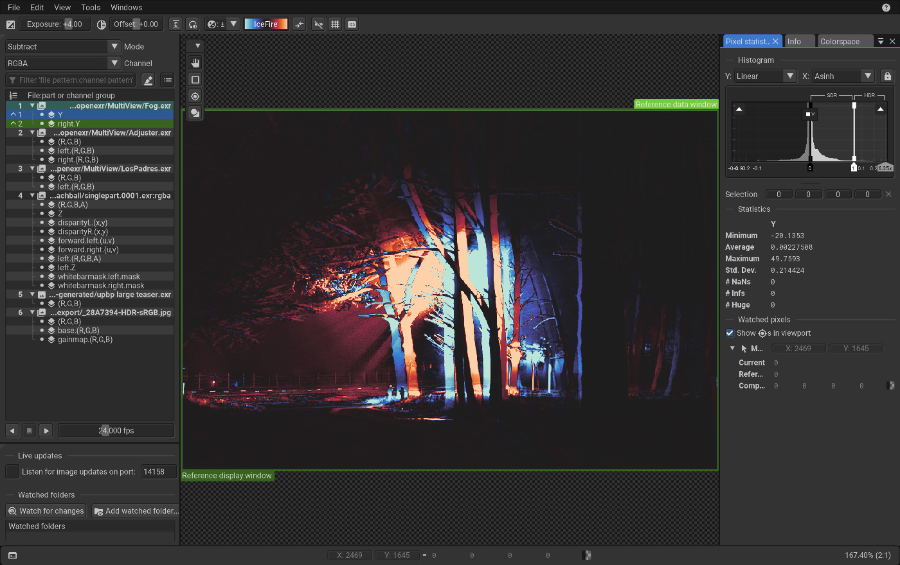
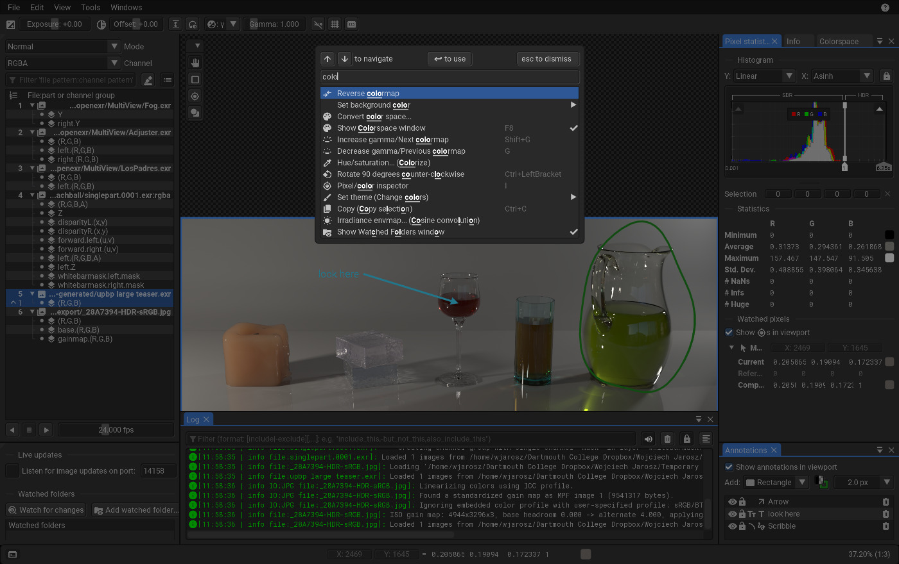

# HDRView

[](https://github.com/wkjarosz/hdrview/actions/workflows/ci-mac.yml) [](https://github.com/wkjarosz/hdrview/actions/workflows/ci-linux.yml) [](https://github.com/wkjarosz/hdrview/actions/workflows/ci-windows.yml) [](https://github.com/wkjarosz/hdrview/releases) [](LICENSE.txt)

HDRView is a research-oriented image viewer for examining and comparing high-dynamic-range images. It runs on macOS, Linux, and Windows, and a slightly limited version **directly in your browser** [[stable version](https://wkjarosz.github.io/hdrview/)] [[development version](https://wkjarosz.github.io/hdrview/dev)] (a desktop build will get you all the features). This even works on an iPhone or iPad!



## Why HDRView

Most image viewers are built to display and browse images. You can of course do that in HDRView too, but HDRView facilitates looking at renders, comparing variants, and chasing down the reason an image does not look the way it should. It is built to let you *inspect* and *compare* images: what the values actually are, which color space they are in, how two images differ, and what the file claims about itself in its metadata. Where it has to assume something about a file's color, it says which assumption it made and lets you override it.

## Features

**Viewing and tonemapping**
- Exposure, black-point offset, and gamma, all live.
- False-color and positive/negative modes over 17 built-in colormaps (Viridis, Turbo, Inferno, Spectral, IceFire, …).
- Blue-noise dithering when values are quantized for an SDR display or an 8-bit file format, which keeps smooth gradients from banding.
- Shadow and highlight clip warnings via zebra striping, with adjustable thresholds.
- Continuous zoom from 1:100 to 512:1, fit-to-display-window / data-window / selection, and horizontal and vertical flips.

**True HDR output** — HDRView asks the display what it can actually show and converts to it, rather than assuming sRGB:

| Platform | HDR output | How |
|---|---|---|
| macOS | ✓ | EDR: a `RGBA16Float` extended-sRGB Metal layer |
| Windows | ✓ | Advanced Color, with the display's headroom read from DXGI |
| Linux (Wayland) | ✓ | The `wp_color_manager_v1` protocol, via a patched GLFW |
| Linux (X11) | SDR | The color-management queries come from the Wayland protocol |
| Web | SDR | No HDR path in the browser build |

On an HDR display this means finer precision (less banding) and brighter whites (less clipping); the histogram marks where the display's SDR range ends and its HDR range begins, and where its ceiling is.

**Color management**
- Embedded ICC profiles (via Little-CMS) and CICP code points, including the ones PNG carries in `cICP` and an ICC profile carries in its `cicp` tag.
- Support for gainmap-based HDR images taken by recent phones (JPEG, HEIC, AVIF, JPEG XL, and UltraHDR files; covering the ISO 21496-1, Adobe, and Apple flavors).
- Per-image gamut and transfer-function overrides: 15 named gamuts (sRGB/BT.709, BT.2020/2100, DCI-P3, Display P3, AdobeRGB, ProPhotoRGB, ACES AP0, ACEScg AP1, CIE 1931 XYZ, …), 23 named illuminants (D50–D93, DCI, ACES), 12 transfer functions, and four chromatic-adaptation methods.
- An interactive CIE 1931 chromaticity diagram with the spectral locus, the Planckian locus, and a draggable gamut triangle.

**Inspection**
- A pixel grid and per-pixel numeric readouts, drawn over the image once you zoom in far enough.
- Watched pixels: pin any number of probes and read current, reference, and composite values at each.
- Rectangular selections, with statistics (min/max/average/std. dev., and counts of NaNs and infinities) computed over just the selection.
- A histogram with linear, sRGB, asinh, and symlog axis scales.



**Comparison**
- Any image can be set as the *reference*, and the two are composited through one of nine blend modes: normal, multiply, divide, add, average, subtract, relative subtract, difference, relative difference.
- The current and reference images are chosen independently, down to the channel group, so two layers of one file compare as readily as two files.

Below, the two views of a stereo EXR are subtracted from one another and the signed result read through the diverging IceFire colormap.



**Multi-layer and multi-part files**
- Channels are grouped automatically into RGBA, XYZ, luminance-chroma, UV, depth, and single-channel groups.
- Nested layers (`layer.sublayer.channel`) are browsable as a flat list or a tree.
- Multi-part OpenEXR files open as one image per part.
- Filter the image list and channel list together with an include/exclude pattern, or restrict what gets loaded in the first place with a channel selector.

**Metadata** — EXIF, XMP (as a structured tree and as raw XML), ICC, and format-specific header fields, all filterable.

**Workflow**
- Watched folders: point HDRView at a directory and it loads new files and reloads changed ones as they appear — useful when a renderer is writing into it.
- Sessions (`.hsess`) save the image list and view state; an exported session *bundle* zips the images with it, so it can be handed to someone else or opened in the web build.
- Step through the image list like a flipbook at an adjustable frame rate.
- A Log window with controllable severity levels and filtering.
- Extensive keyboard shortcuts, and a VS Code/Atom/Sublime Text-style command palette (`Ctrl`/`Cmd+Shift+P`) allowing you to find any command with keyboard-based fuzzy searching:



## Supported formats

HDRView picks a decoder by inspecting a file's contents rather than by trusting its extension, and is careful to interpret and display its colors correctly.

| Format | Description | Read | Write |
|---|---|:--:|:--:|
| OpenEXR (.exr) | High-dynamic-range format by Industrial Light & Magic, including multichannel, multi-part, and arbitrary metadata attributes (via [OpenEXR](https://github.com/AcademySoftwareFoundation/openexr)) | ✓ | ✓ |
| Portable Float Map (.pfm) | Dead simple HDR floating-point format | ✓ | ✓ |
| UltraHDR (.jpg) | Gain-mapped HDR images from recent Android phones (via [libultrahdr](https://github.com/google/libultrahdr)) | ✓ | ✓ |
| JPEG (.jpg, .jpeg) | Including the ISO 21496-1, Adobe, and Apple gain maps that HDR photos pack alongside the base image (via [libjpeg-turbo](https://github.com/libjpeg-turbo/libjpeg-turbo)) | ✓ | ✓ |
| PNG (.png) | Including animated PNGs and HDR PNGs with CICP (via [libpng](https://github.com/pnggroup/libpng)) | ✓ | ✓ |
| TIFF (.tif, .tiff) | Including SGI LogLuv and Pixar Log HDR formats (via [libtiff](https://gitlab.com/libtiff/libtiff)) | ✓ | ✓ |
| JPEG-XL (.jxl) | Including lossless, lossy, animation/burst, HDR, and gain maps (via [libjxl](https://github.com/libjxl/libjxl)) | ✓ | ✓ |
| HEIF, AVIF (.heif, .heic, .avif, .avci) | Including lossless, lossy, animation/burst, HDR, and the gain maps in HDR photos from iPhones (via [libheif](https://github.com/strukturag/libheif) and various codec libraries). Output is HEIF or AVIF | ✓ | ✓ |
| WebP (.webp) | Google's format supporting lossy/lossless and animation (via [libwebp](https://chromium.googlesource.com/webm/libwebp)) | ✓ | ✓ |
| QOI (.qoi) | Quite OK Image — simple, fast, lossless (via [qoi](https://github.com/phoboslab/qoi)) | ✓ | ✓ |
| Radiance HDR (.hdr) | The original RGBE-encoded HDR format (via [stb_image](https://github.com/nothings/stb)) | ✓ | ✓ |
| BMP (.bmp) | Bitmap (via [stb_image](https://github.com/nothings/stb)) | ✓ | ✓ |
| TGA (.tga) | Targa raster image (via [stb_image](https://github.com/nothings/stb)) | ✓ | ✓ |
| DDS (.dds) | DirectX GPU/compressed texture formats (via [smalldds](https://github.com/wkjarosz/smalldds)) | ✓ | |
| Camera RAW | DNG plus the usual per-vendor formats — .cr2/.cr3, .nef, .arw, .raf, .orf, .rw2, .x3f and many more (via [LibRaw](https://github.com/LibRaw/LibRaw)) | ✓ | |
| PSD (.psd) | Adobe Photoshop files (via [stb_image](https://github.com/nothings/stb), plus HDRView's own metadata extraction) | ✓ | |
| GIF (.gif) | Including animation — every frame is loaded (via [stb_image](https://github.com/nothings/stb)) | ✓ | |
| PNM (.pnm, .pgm, .ppm) | Netpbm portable bitmaps (via [stb_image](https://github.com/nothings/stb)) | ✓ | |
| PIC (.pic) | Softimage PIC (via [stb_image](https://github.com/nothings/stb)) | ✓ | |

JPEG 2000 and HTJ2K are supported as codecs *inside* HEIF containers, not as standalone `.jp2` files.

Which formats a particular build actually has depends on its `HDRVIEW_ENABLE_*` options; the About dialog's Build info tab lists what was compiled in.

## Installing

Pre-built binaries for every release are on the [releases page](https://github.com/wkjarosz/hdrview/releases):

| Platform | Download |
|---|---|
| macOS (Apple Silicon, Intel) | `.dmg` |
| Linux (x86_64, arm64) | `.appimage` |
| Windows (x86_64, ARM64) | `.zip` — the `.exe` plus its `assets` folder |
| Anything with a browser | [wkjarosz.github.io/hdrview](https://wkjarosz.github.io/hdrview/) |

**macOS.** Copy `HDRView.app` to `/Applications`. The app is unsigned, so macOS will refuse to open it the first time; either allow it under System Settings → Privacy & Security, or run `xattr -dr com.apple.quarantine /Applications/HDRView.app`.

**Windows.** Keep `HDRView.exe` and its `assets` folder together. HDRView declares itself long-path aware in its application manifest, so it can open files at paths longer than 260 characters — but only if the system-wide policy is also on, which HDRView cannot enable for you. To turn it on, run as Administrator:

```powershell
New-ItemProperty -Path "HKLM:\SYSTEM\CurrentControlSet\Control\FileSystem" `
  -Name "LongPathsEnabled" -Value 1 -PropertyType DWORD -Force
```

(or via Group Policy: *Computer Configuration → Administrative Templates → System → Filesystem → Enable Win32 long paths*). A reboot may be needed before every process picks it up.

**Linux.** `chmod +x` the AppImage and run it.

## Command-line usage

```
HDRView [OPTIONS] [IMAGES...]
```

| Option | Meaning |
|---|---|
| `-e`, `--exposure FLOAT` | Power-of-2 exposure value; gain = 2<sup>exposure</sup> (default 0) |
| `-g`, `--gamma FLOAT` | Gamma for exposure+gamma tonemapping |
| `--dither` / `--no-dither` | Dithering when converting to LDR (default on) |
| `--sdr` | Force standard dynamic range output, whatever the display can do |
| `-v`, `--verbosity INT` | Log threshold, 0 (trace) to 6 (off); default 2 (info) |
| `--apple-keys` / `--non-apple-keys` | Whether shortcuts use Cmd or Ctrl |
| `--version` | Print the version, build timestamp, and rendering backend |
| `-h`, `--help` | Print the full help text |

A positional argument beginning with a colon is a **channel selector** rather than a file, and applies to every image after it until the next one. It takes a comma-separated list of patterns matched against whatever substructure the format has — parts, layers, channels, animation frames — where a leading `-` excludes. So this loads only the depth channels of the first file and everything but the masks from the second:

```bash
HDRView :Z render.exr :-mask comparison.exr
```

On macOS the executable lives inside the bundle, at `HDRView.app/Contents/MacOS/HDRView`; symlink it onto your `PATH` if you want it there.

## Building from source

> [!IMPORTANT]
> Build from a [published release tag](https://github.com/wkjarosz/hdrview/tags). `master` is the development branch and may be broken between releases.

You need CMake ≥ 3.13 and a C++17 toolchain (Xcode, Visual Studio, or GCC/Clang). `ninja` makes builds faster, and `emscripten` is required only for the web build.

Everything is driven through [`CMakePresets.json`](CMakePresets.json) — there is no ad hoc build path:

```bash
cmake --list-presets=configure
cmake --list-presets=build
```

- **macOS**
  ```bash
  cmake --preset macos-arm64-cpm         # or macos-x86_64-cpm, macos-universal
  cmake --build --preset macos-arm64-cpm-release
  ```
- **Linux**
  ```bash
  cmake --preset linux-local             # or linux-cpm, linux-appimage
  cmake --build --preset linux-local-release
  ```
- **Windows**
  ```bash
  cmake --preset windows-msvc            # or windows-arm64-msvc, windows-ninja
  cmake --build --preset windows-msvc-release
  ```
- **Web** — always through `emcmake`, which points `CMAKE_TOOLCHAIN_FILE` at the active SDK; the preset's own `toolchainFile` only resolves against a Homebrew-style `EMSDK`.
  ```bash
  emcmake cmake --preset emscripten
  cmake --build build/emscripten --parallel
  ```

Presets are named `<platform>-<arch?>-<cpm|local>`, with build presets adding `-debug`, `-release`, `-minsizerel`, or `-relwithdebinfo`.

`-cpm` presets fetch and build third-party dependencies with [CPM.cmake](https://github.com/cpm-cmake/CPM.cmake). `-local` presets set `CPM_USE_LOCAL_PACKAGES`, so `find_package` is tried first — usually what you want on Linux. Either way some system packages must already be installed, because CPM-fetched dependencies `find_package()` dependencies of their own. On Ubuntu 24.04 that is what CI installs:

```bash
sudo apt-get install cmake ninja-build xorg-dev libglu1-mesa-dev libxrandr-dev libglfw3-dev \
  libwayland-dev wayland-protocols libxkbcommon-dev libdbus-1-dev zlib1g-dev libfreetype-dev \
  libjpeg-dev libpng-dev libtiff-dev libwebp-dev libjxl-dev libopenexr-dev libimath-dev \
  liblcms2-dev libraw-dev libexif-dev libspdlog-dev libfmt-dev libcli11-dev libopenjp2-7-dev \
  libopenh264-dev libheif-dev libaom-dev libdav1d-dev libde265-dev libx265-dev \
  libheif-plugin-x265 libheif-plugin-libde265 libheif-plugin-aomenc libheif-plugin-aomdec \
  libheif-plugin-dav1d
```

`libdav1d-dev` is optional but worth having: it decodes the AV1 in an AVIF several times faster than
libaom does, and libheif prefers it whenever both are present. Without it AVIF still works, just more
slowly. See `HDRVIEW_ENABLE_DAV1D`.

See the workflows under [`.github/workflows/`](.github/workflows) for the other platforms.

Format support and a few other features are individually toggleable at configure time — `HDRVIEW_ENABLE_LIBJXL`, `HDRVIEW_ENABLE_LIBRAW`, `HDRVIEW_ENABLE_AVIF`, `HDRVIEW_ENABLE_LIBWEBP`, `HDRVIEW_ENABLE_LIBTIFF`, `HDRVIEW_ENABLE_LIBUHDR`, `HDRVIEW_ENABLE_HDR_DISPLAY`, and others; see the top of [`CMakeLists.txt`](CMakeLists.txt). Pass them as `-D<OPTION>=OFF`.

### Packaging

```bash
cpack -C Release -G DragNDrop   # macOS .dmg
cpack -C Release -G External    # Linux .appimage, after building the linux-appimage preset
```

There are also `workflowPresets` for these: `dmg-arm64-cpm`, `dmg-universal`, `appimage`, and friends.

### Tests

Two suites, both off by default:

```bash
cmake --preset linux-cpm -DHDRVIEW_BUILD_TESTS=ON -DHDRVIEW_BUILD_GUI_TESTS=ON
cmake --build --preset linux-cpm-release
ctest --test-dir build/linux-cpm -C Release --output-on-failure
```

`HDRVIEW_BUILD_TESTS` builds `hdrview_tests`, a [doctest](https://github.com/doctest/doctest) suite covering color-space round-trips, the loaders, metadata parsing, and export. `HDRVIEW_BUILD_GUI_TESTS` builds `hdrview_gui_tests`, which drives a real HDRView instance through [Dear ImGui Test Engine](https://github.com/ocornut/imgui_test_engine); it needs a display server, so on a headless machine run it under `xvfb-run -a`.

The screenshots in this README are generated by that same GUI harness:

```bash
./resources/regenerate-screenshots.sh                              # in-tree sample images
HDRVIEW_SCREENSHOT_IMAGES=~/photos ./resources/regenerate-screenshots.sh   # your own
```

## License

- Copyright (c) Wojciech Jarosz
- 3-clause BSD — see [LICENSE.txt](LICENSE.txt).

## Credits

HDRView builds on a good deal of open-source work. The About dialog's Credits tab lists every library it relies on.
