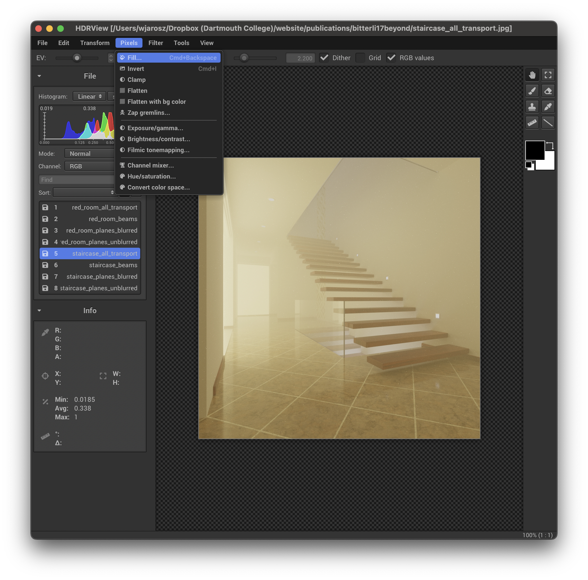

# HDRView

HDRView is a simple research-oriented high-dynamic range image viewer with an emphasis on examining and comparing images, and including minimalistic tonemapping capabilities. HDRView currently supports reading EXR, PNG, TGA, BMP, HDR, JPG, GIF, PNM, PFM, and PSD images and writing EXR, HDR, PNG, TGA, PPM, PFM, and BMP images.

## Example screenshots
HDRView supports loading several images and provides exposure and gamma/sRGB tone mapping control with high-quality dithering of HDR images.

When sufficiently zoomed in, HDRView can overlay the pixel grid and numeric color values on each pixel to facilitate inspection.

Displaying HDR images naively on a 24 bit display leads to visible banding in smooth gradients.

HDRView supports high-quality dithering (both when viewing and when saving to an LDR file) to reduce these artifacts.

## Compiling

Compiling from scratch requires CMake and a recent version of XCode on macOS, Visual Studio 2015 on Windows, and GCC on Linux.

On Linux and macOS, compiling should be as simple as

    git clone --recursive https://bitbucket.org/wkjarosz/hdrview.git
    cd hdrview
    mkdir build
    cd build
    cmake-gui ../
    make -j 4

On Windows, a few extra steps are needed.

Since MSVC's regex implementation is buggy, you first need to have the [Boost](http://www.boost.org/) regex library installed. You can find binary installers for Windows on the Boost website. You need at least Boost version 1.53.

After cloning the repo, open up ``cmake-gui``. Click "Add Entry" to define the ``BOOST_ROOT`` directory, and set it to your root Boost directory. Run Configure and select your version of Visual C++ and 64bit. After configure finishes, search for ``USE_BOOST_REGEX`` and check it. Run configure again, and then click Generate.

Open the generated file ``HDRView.sln`` and proceed building as usual from within Visual Studio.

## Installing on macOS

Compiling on macOS builds a mac bundle named ``HDRView`` which you can put into your ``/Applications/`` folder. If you'd like to easily launch HDRView also from the command-line, then you can add an alias to your ``.bash_profile``:

    alias hdrview='/Applications/HDRView.app/Contents/MacOS/HDRView'

## Usage

Run ``./hdrview --help`` to see command-line usage, or run ``./hdrview `` and hit the ``h`` button to see a list of keyboard shortcuts in the application.

## License

Copyright (c) Wojciech Jarosz

3-clause BSD. For details, see the ``LICENSE.txt`` file.

HDRView depends on the following libraries (which are included explicitly or as git submodules):

* Wenzel Jakob's [NanoGUI](https://github.com/wjakob/nanogui) library, which is licensed under a BSD-style license.
* ILM's [OpenEXR](http://www.openexr.com) library, which is licensed under a modified BSD license.
* Some [stb](https://github.com/nothings/stb) libraries, developed by Sean Barrett and released into the public domain.
* The [tinydir](https://github.com/cxong/tinydir/) library, which is licensed under a simplified BSD.
* The [docopt.cpp](https://github.com/docopt/docopt.cpp) library, which is dual-licensed under MIT and Boost licenses.
* Gabi Melman's [spdlog](https://github.com/gabime/spdlog) library, which is licensed under the MIT license.
